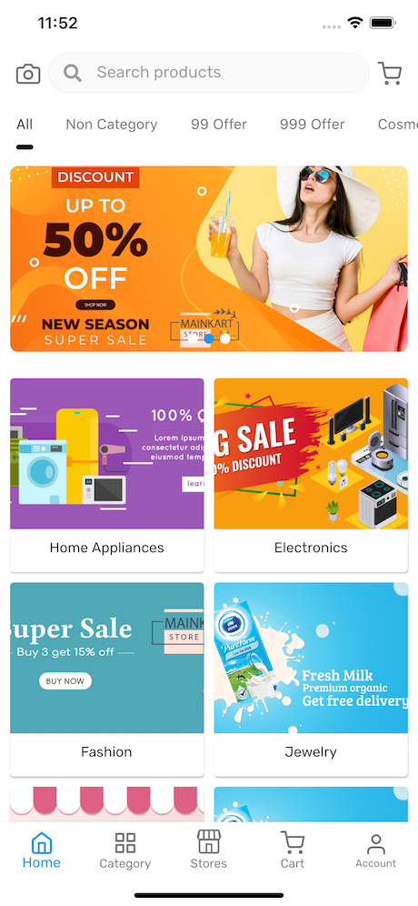
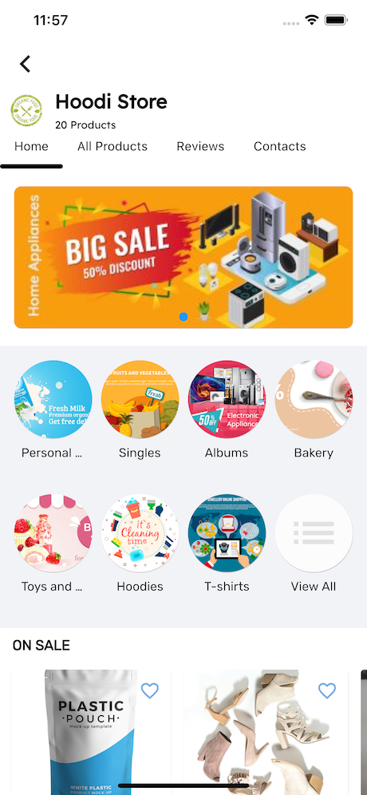
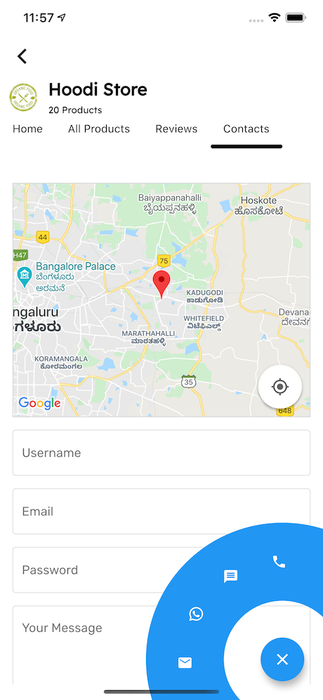
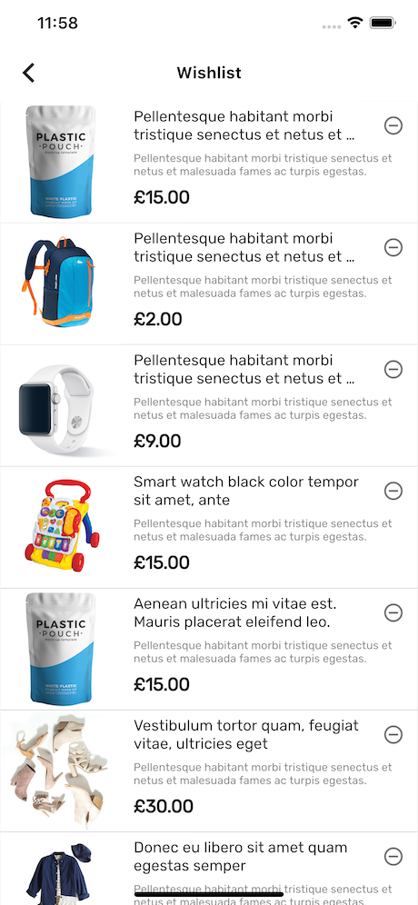
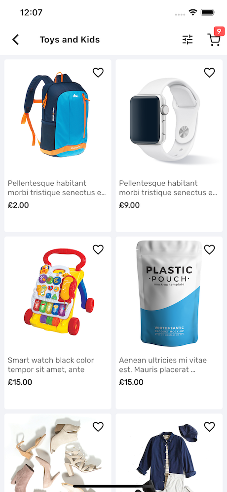
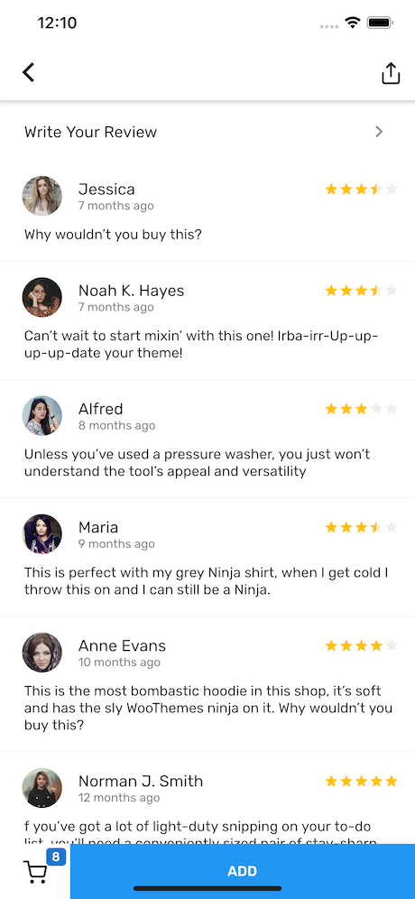

# MultiVendor-Flutter

Flutter Multivendor Mobile app for WooCommerce.

### Vendor Features:

Vendor Login, Add Products, Edit Products, View and Manage Orders, Notification For New Order, Vendor Chat with Customers

### Live Document: 

https://mstoreapp.com/documents/flutter/woocommerce/woocommerce/

## Screenshot

|                Screenshot               |                 Screenshot            |               Screenshot              |
|:---------------------------------------:|:-------------------------------------:|:-------------------------------------:|
|    |      |    |

|                Screenshot               |                 Screenshot            |               Screenshot              |
|:---------------------------------------:|:-------------------------------------:|:-------------------------------------:|
|    |      |    |

## Getting Started

This project is a starting point for a Flutter application.

A few resources to get you started if this is your first Flutter project:

- [Lab: Write your first Flutter app](https://flutter.dev/docs/get-started/codelab)
- [Cookbook: Useful Flutter samples](https://flutter.dev/docs/cookbook)

For help getting started with Flutter, view our
[online documentation](https://flutter.dev/docs), which offers tutorials,
samples, guidance on mobile development, and a full API reference.
